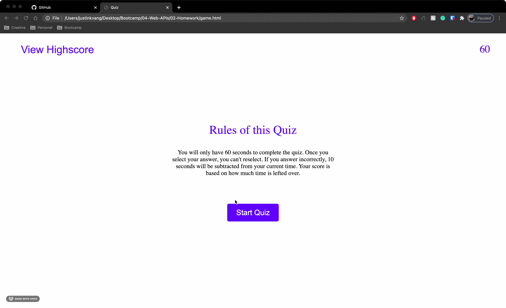

# Code Quiz
What:
A 60 second quiz.

Rules:
You will only have 60 seconds to complete the quiz. 
Once you select your answer, you can't reselect. 
If you answer incorrectly, 10 seconds will be subtracted from your current time. 
Your score is based on how much time is lefted over.

## What I Did
GIVEN I am taking a code quiz
WHEN I click the start button
THEN a timer starts and I am presented with a question
WHEN I answer a question
THEN I am presented with another question
WHEN I answer a question incorrectly
THEN time is subtracted from the clock
WHEN all questions are answered or the timer reaches 0
THEN the game is over
WHEN the game is over
THEN I can save my initials and score

# Justin-s-Code-Quiz
# My-Code-Quiz
# My-Code-Quiz
# My-Code-Quiz
# My-Code-Quiz
# My-Code-Quiz
# My-Code-Quiz
